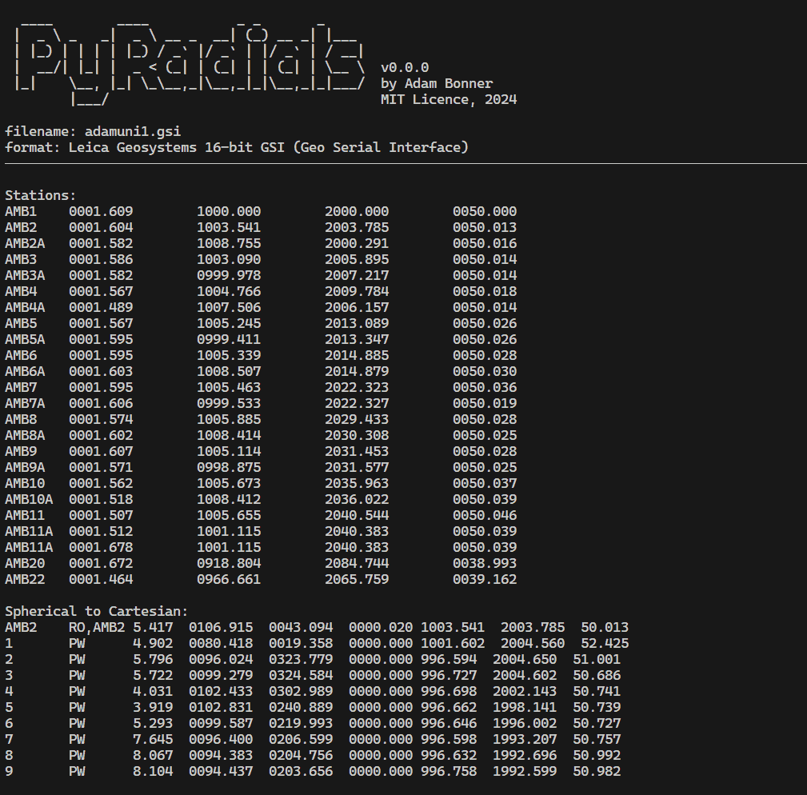

# PyRadials: Field to Finish
Measure, Traverse, Resection, Control, Convert and Create .DXF for Leica TPS1100 Series .GSI Data

> Work in Progress!!


## Introduction

## Installing and using PyRadials (for Users)

## Build and Compile PyRadials (for Developers)

### Python Virtual Environment

#### Create a Python Virtual Environment (for reference)
```ps
# Create Virtual Environment
py -m venv venv

# Upgrade PIP
py -m pip install --upgrade pip
```
#### Check installed Dependencies
py -m pip list --local
#### Record Latest Dependencies in ```requirements.txt```
```ps
pip freeze > 'requirements.txt'
```

#### Use a Python Virtual Environment
#### Compile .exe using PyInstaller
#### Compile installer .exe using NSIS

## Contributing to this Project
This project welcomes contributions of all types. We ask that before you start work on a feature that you would like to contribute, please read the [Contributor's Guide](.github/CONTRIBUTING.md).

## Security Policy for this Project
This project seeks to build secure, versatile and robust portable software. If you find an issue, please report it following the [Security Policy](.github/SECURITY.md)

## Credits

## Useful Links

### Software used for Development
### Hardware Documentation
- [Manuals for Leica Total Stations](https://tmackinnon.com/manuals-for-the-leica-tps1200-and-tcr1105.php)
### Further Reading
### Reference Articles