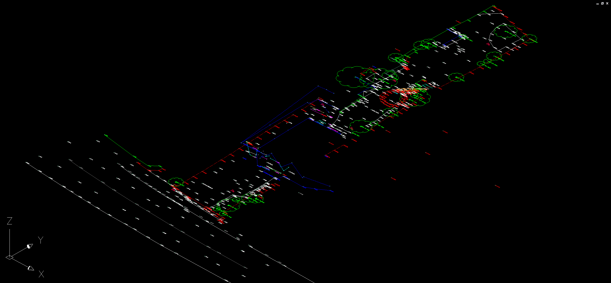
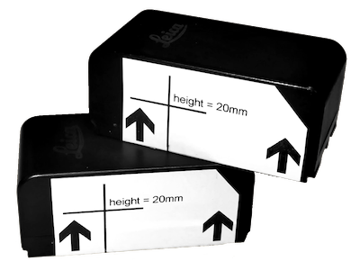

# PyRadials
Manage your Survey from _Field to Finish_: Traverse, Reduce, and Plot Leica TPS1100 .GSI


## Introduction
PyRadials (named after the python programming language and a radial; the line between the total station and an observed point) is a hobby project seeking to "democratise the creation of DXF data from TPS1100 series instruments".



The software's versatility extends to its drafting engine, powered by the EZDXF library, enabling the creation of intricate 3D labelled drawings compatible with AutoCAD. From delineating walls and surface changes to plotting spot levels, PyRadials supports a wide range of codes and layers, facilitating detailed topographical and measured building surveys at multiple scales.

### Roadmap
PyRadials is poised to expand its capabilities with planned integrations like what3words (simplifying locating a station), block support (think trees and toilet icons), and DTM rendering. The aim is to cater to a diverse portfolio of surveying needs.

### I'm interested! what's the catch?
PyRadials adopts a "free to use, paid support" model, ensuring accessibility while providing avenues for users to obtain assistance and guidance as needed. I'd love you to raise a PR, but if you just need a feature, get in touch and you can prioritise my backlog! Frequent updates are expected in the coming weeks and months.

### Mathematical Terminology

| symbol | physics name | other name       | instrument name  | notes                                   |
| :----: | ------------ | ---------------- | ---------------- | --------------------------------------- |
|   r    | radius       | radial distance  | slope distance   | m                                       |
|   θ    | theta        | inclination      | vertical angle   | 0 = zenith / top; 90 = forward          |
|   φ    | azimuth      | horizontal angle | horizontal angle | azimuth = (90 - horizontal_angle) % 360 |

Switching between Survey and Physics terms is tough, this table serves as a handy reference. The biggest stumbling block during development of the spherical-to-cartesian mathematics was noticing the azimuth and horizontal angle are not the same.

An azimuth (φ) is commonly defined as pointing along the positive x-axis. Thus, azimuth 0 points in the direction of the positive x-axis (in survey terms "East"; whereas the Total Station typically points towards relative "North"/"forwards" when at 0°00'00").

A function (```horizontal_to_azimuth()```) to convert horizontal angle to azimuth is in the [```calc.py```](pyradials/calc.py) source code file


## Installing and using PyRadials (for Users)

### Instrument / Total Station Setup and Configuration

#### Leica TPS 1100

##### Setup Instrument Recording (```RMask```) and Display (```DMask```) masks
> __Note__: This is a one-time activity, ensuring the .GSI is produced with the correct polar (spherical) coordinates.

```
Instruction Steps
1.
2.
3.
```

##### Survey Job () Setup
```
Instruction Steps for First Station
1.
2.
3.

Instruction Steps for All Other Stations
1.
2.
3.
```

##### Reflectorless Stickers for Internals



As a measured-building / floorplan surveyor, often the accuracy demands of such layouts meant traversing with a reflector wasn't required as was often cumbersome. This solution includes simple 20mm stickers in Dymo Label v8.5.0.1751 (2013) format stored in the [```labels```](docs/labels/)  folder.

These labels can be stuck directly to the total station battery (illustration: right) and used as a quick and easy 20mm tall target inside. I recommend putting one on each battery so you always have a target available!

## Build and Compile PyRadials (for Developers)

### Python Virtual Environment
> __Note__: without setting up the correct ```vevn```, you will likely see ```ModuleNotFoundError``` errors when using this solution, if you're new to venv I recommend a quick web/video search!

#### Create a Python Virtual Environment (once only, for reference)
```ps
# Create the Virtual Environment, named venv
py -m venv venv

# Upgrade PIP
py -m pip install --upgrade pip
py -m pip install --upgrade setuptools

# List installed packages
py -m pip list --local

# Capture installed packages
pip freeze > 'requirements.txt'
```

#### Using a Python Virtual Environment
```ps
# Create the Virtual Environment, named venv
py -m venv venv

# Activate Virtual Environment (Windows Terminal)
.\venv\Scripts\Activate.ps1

# Install Prerequisites
py -m pip install -r '.\requirements.txt'
```

### Make
#### Use python script to compile solution and installer ```.exe```'s
```ps
py 'scripts/make.py'
```

#### Compile ```.exe``` using PyInstaller _only_
```ps
pyinstaller 'pyradials/pyradials.spec' --noconfirm
```

#### Compile installer ```.exe``` using NSIS _only_ (requires solution ```.exe```)
```ps
makensis 'installer/pyradials.nsi'
```

## Contributing to this Project
This project welcomes contributions of all types. We ask that before you start work on a feature that you would like to contribute, please read the [Contributor's Guide](.github/CONTRIBUTING.md).

## Security Policy for this Project
This project seeks to build secure, versatile and robust portable software. If you find an issue, please report it following the [Security Policy](.github/SECURITY.md)

## Credits
The following organisations, projects, and people helped make PyRadials happen, so I've linked to their sites/projects with a short explanation of their contribution:
- [Geo Spatial Survey Solutions Ltd.](http://www.geo-spatial.co.uk/): Survey company offering an accurate measuring service using sophisticated electronic measuring equipment. Thanks for their advice and support!
- [SEP Geophysical Ltd.](https://www.sepgeophysical.com/): A multidisciplinary geophysical company providing a comprehensive range of services to clients from various industries, part of the Survey & Engineering Projects family of businesses. Thanks for their knowledge and equipment hire!

## Useful Links
> __note__: that by clicking on external links provided on this readme, you are leaving our project. We do not endorse or take responsibility for the content, privacy practices, or any other aspect of external sites. Proceed at your own discretion.

### Software used for Development
- The [NSIS](https://nsis.sourceforge.io/Main_Page) Project for Windows Installer creation:
- [Paint.net](https://getpaint.net/) for Image editing
- [IcoFx Portable](https://portableapps.com/apps/graphics_pictures/icofx_portable) for Icon file editing
- [Dymo Label](https://download.dymo.com/dymo/Software/Win/DLS8Setup.8.5.4.exe) v8
- 

### Font used by this Project
- [Michroma](https://fonts.google.com/specimen/Michroma) is an open font based on the classic Microgramma utilised by "Star Trek"

### Hardware Documentation
- [Manuals for Leica Total Stations](https://tmackinnon.com/manuals-for-the-leica-tps1200-and-tcr1105.php)
- [Dymo Label v8 Usage](https://help.dymo.com/s/article/How-to-use-DYMO-Label-Software-v-8?language=en_US)
- 

### Further Reading
- [Azimuth](https://en.wikipedia.org/wiki/Azimuth) from Wikipedia
- [Spherical coordinate system](https://en.wikipedia.org/wiki/Spherical_coordinate_system) from Wikipedia
- 

### Reference Articles
- Gitea Error: [RPC failed; curl 56 Recv failure](https://stackoverflow.com/questions/75525749/how-to-fix-this-error-rpc-failed-curl-56-recv-failure-connection-was-reset)
- 