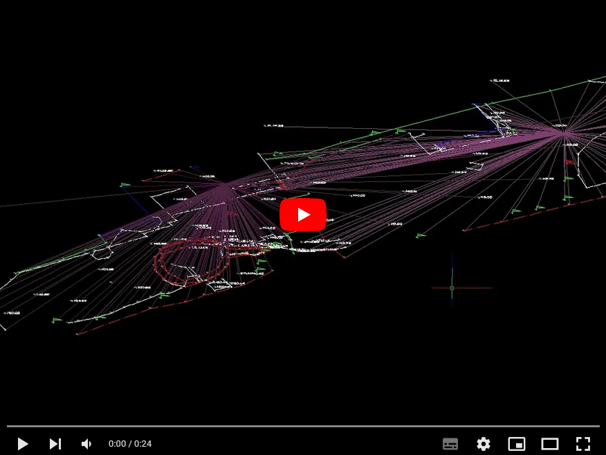
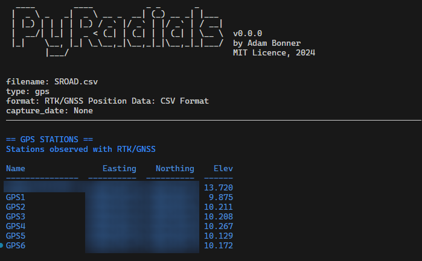
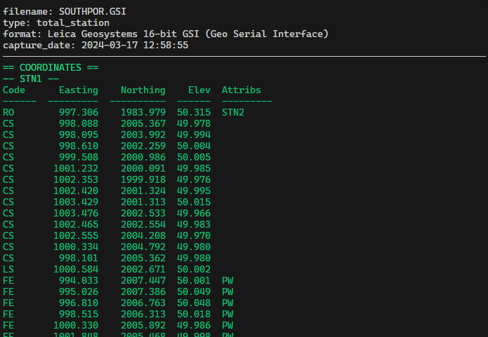
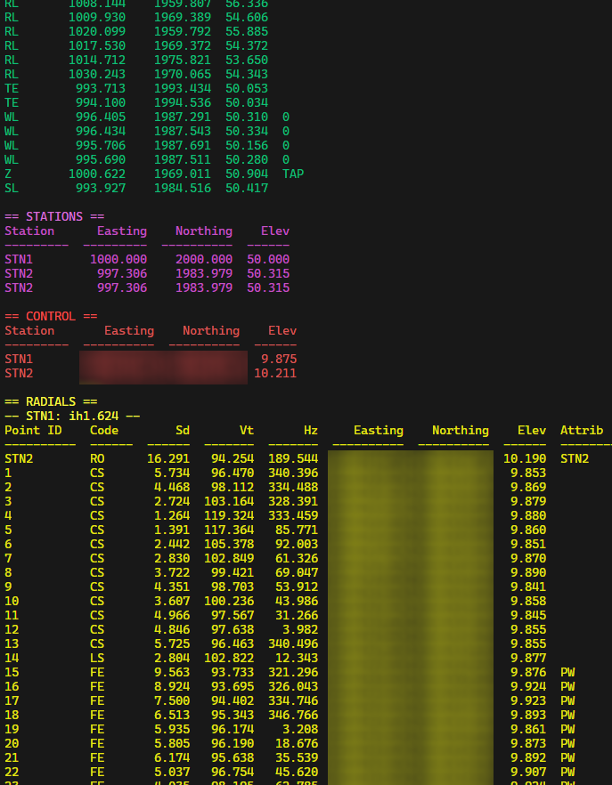

# PyRadials: Field to Finish
Measure, Traverse, Resection, Control, Convert and Create .DXF for Leica TPS1100 Series .GSI Data

> Work in Progress!!, work up and until v1.0.0 is being completed in the **develop** branch

**What's working?**
- read Leica TPS1100 .GSI File
- read Trimble TSC3 RTK/GNSS CSV File
- Extract Codes and Observations (Hz, Vt, H)
- Derive "Coded" Cartesian Coords (Easting, Northing, Elevation) from Polar Observations
- Transpose "local" (2000,1000,50) survey to OSGB36 coords
- Create DXF format drawing of coded coords
- Linework and Layers for DXF
- Simple "block" flag for stations/trees etc.
- Full and proper 3D
- Radial lines from instrument to recorded point/observation
- what3words support for OSGB36 to W3W converstion

_PyRadials: Sample Video 1 now on Youtube_

